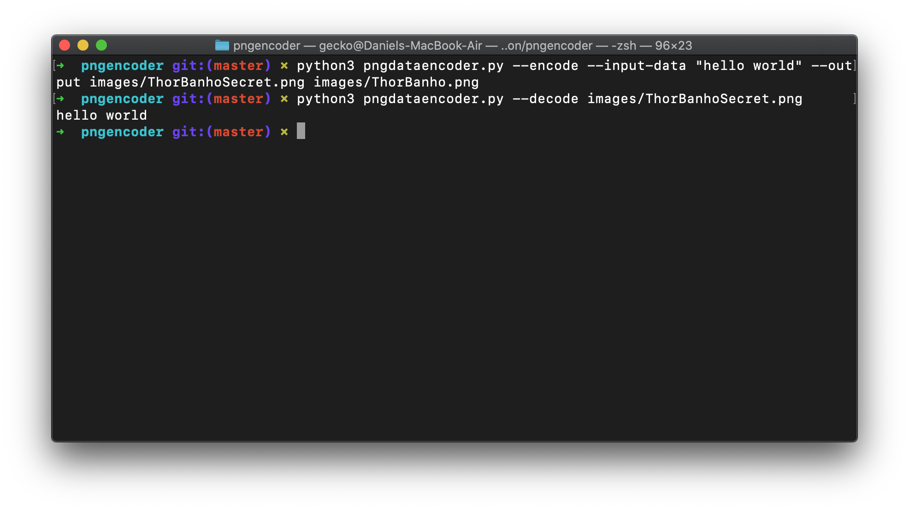

# Overview

Simple encode decode data to PNG files

In this example I encode a secret image to images/thorsecret.png
And then decode it to to reveal.jpeg

```
python3 pngdataencoder.py --encode images/thor.png --input-file secret.jpeg --output-path images/thorsecret.png
python3 pngdataencoder.py --decode images/thorsecret.png --output-path reveal.jpeg
```

You can also encode decode from url, just pass `--from-url` and pass the url to the `image` argument.

```
python3 pngdataencoder.py --decode --from-url --output-path outhhehe.jpeg https://raw.githubusercontent.com/dhilst/pngencoder/master/images/thorsecret.png
```

Input image:


Output image with secret.jpeg encoded on it:


Here is another example with a simple hello world:




# Dependencies

* Python3
* Pillow
* requests

To install in a vitual environment

```
test -d venv || python3 -m venv venv
source vevn/bin/activate
pip3 install -r requirements.txt
```

# Things to note:

* Data is not encrypted in anyway, but you can encrypt it up front
* It uses the blue bit to store data
* It's using the first 4 pixels to encode the size of the data
* It's using the lower 2 bits of the blue pixel to encode data


This was heavly inspired by [this](https://twitter.com/hardmaru/status/1319965852251254784?s=20) tweet

The idea to use lower bits was from [@coproduto](https://twitter.com/coproduto/status/1320148011834613760?s=20), thank you!

And it's licensed over Apache-2.0 license :)

Use it wisely!
